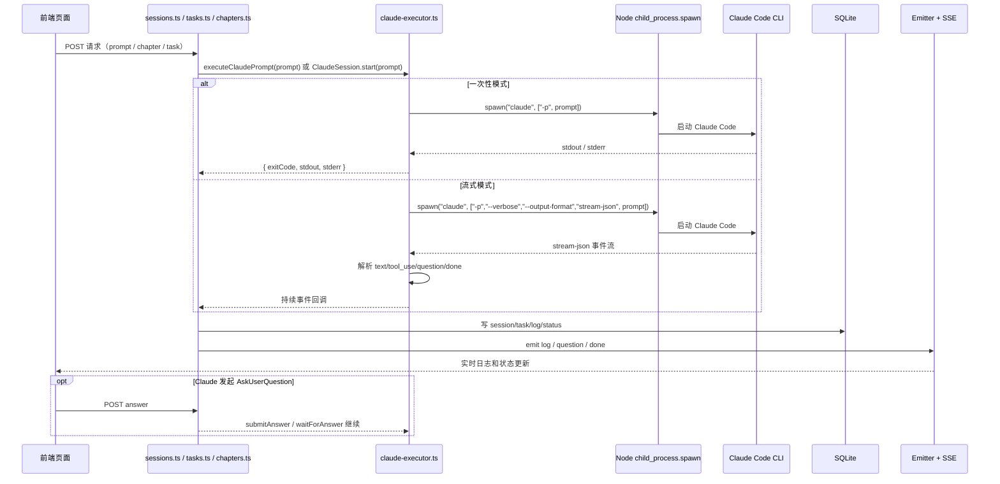

# fanqie-workbench 如何调用 Claude Code

本文说明 `fanqie-workbench/` 在项目中是如何调起 Claude Code 的，包括前端入口、后端路由、执行层、日志流和人工问答回路。

## 核心结论

`fanqie-workbench` **不是**通过 Claude SDK 或直接请求 HTTP API 来调用模型。

它的方式是：

1. 前端页面发起请求到本地 Fastify 服务。
2. 后端路由调用 `src/claude/claude-executor.ts`。
3. 执行层通过 Node.js `spawn('claude', ...)` 启动本机 Claude Code CLI。
4. 将 Claude Code 的 `stdout/stderr` 或 `stream-json` 事件流写入数据库并通过 SSE 推回前端。
5. 如果 Claude Code 发起 `AskUserQuestion`，前端再把用户回答提交回后端，继续执行。

一句话概括：

> `fanqie-workbench` 是把 **Claude Code 当作本地命令行程序** 来调用，而不是把它当成远程 API。

---

## 关键代码位置

### Claude 执行入口

- `fanqie-workbench/src/claude/claude-executor.ts:25`
  - 用 `spawn('claude', args, ...)` 启动 Claude Code
- `fanqie-workbench/src/claude/claude-executor.ts:122`
  - 一次性执行 `claude -p "<prompt>"`

### 后端路由

- `fanqie-workbench/src/server/app.ts:12`
  - 注册任务、会话、章节等路由
- `fanqie-workbench/src/server/routes/tasks.ts:30`
  - 普通任务调用 `executeClaudePrompt(prompt)`
- `fanqie-workbench/src/server/routes/sessions.ts:132`
  - prompt 会话调用 `executeClaudePrompt(prompt)`
- `fanqie-workbench/src/server/routes/sessions.ts:217`
  - 章节流程中使用带人工回路的 Claude 执行
- `fanqie-workbench/src/server/routes/chapters.ts:158`
  - 章节流水线处理中使用 `runClaudeWithHumanLoop(...)`

### 前端入口

- `fanqie-workbench/src/web/pages/prompt-page.tsx:85`
  - 自由会话页调用 `/api/sessions`
- `fanqie-workbench/src/web/pages/books-page.tsx:371`
  - 新建一本书时调用 `/api/sessions`
- `fanqie-workbench/src/web/pages/books-page.tsx:424`
  - 章节处理时调用 `/api/sessions`
- `fanqie-workbench/src/web/pages/books-page.tsx:460`
  - 章节高级动作时调用 `/api/sessions`

### 实时日志流

- `fanqie-workbench/src/server/routes/task-stream.ts:10`
  - `/api/tasks/:taskId/stream` SSE
- `fanqie-workbench/src/server/routes/sessions.ts:295`
  - `/api/sessions/:sessionId/stream` SSE

---

## Claude Code 调用方式

项目里主要有两种方式。

### 1. 一次性执行

用于普通任务、简单 prompt、非交互步骤。

对应代码：

- `fanqie-workbench/src/claude/claude-executor.ts:114`

实际效果相当于：

```bash
claude -p "你的 prompt"
```

特征：

- 一次执行完毕后返回
- 收集完整 `stdout/stderr`
- 适合后台任务、简单生成、非交互流程

### 2. 流式会话执行

用于需要持续接收事件、工具调用、人工回答问题的流程。

对应代码：

- `fanqie-workbench/src/claude/claude-executor.ts:18`

实际效果相当于：

```bash
claude -p --verbose --output-format stream-json "你的 prompt"
```

特征：

- 持续监听 Claude Code 输出
- 按行解析 JSON 事件
- 支持：
  - assistant 文本输出
  - tool_use
  - `AskUserQuestion`
  - done 结束事件

---

## 完整调用链路图

```mermaid
flowchart TB
    subgraph FE[前端 Web UI]
        A1[BooksPage<br/>书籍页]
        A2[PromptPage<br/>自由会话页]
        A3[LiveLogPanel<br/>实时日志面板]
        A4[用户回答问题<br/>answer]
    end

    subgraph API[Fastify Server]
        B0[server/app.ts<br/>注册所有路由]
        B1[/api/sessions<br/>sessions.ts]
        B2[/api/sessions/:id/stream<br/>SSE]
        B3[/api/sessions/:id/answer]
        B4[/api/tasks<br/>tasks.ts]
        B5[/api/tasks/:id/stream<br/>SSE]
        B6[/api/tasks/:id/answer]
        B7[/api/chapters/:id/process<br/>chapters.ts]
    end

    subgraph EXEC[Claude 执行层]
        C1[executeClaudePrompt<br/>一次性执行]
        C2[ClaudeSession.start<br/>流式会话]
        C3[runClaudeWithSessionLoop / runClaudeWithHumanLoop<br/>等待人工回答]
    end

    subgraph CLI[本机 Claude Code CLI]
        D1[claude -p prompt]
        D2[claude -p --verbose --output-format stream-json prompt]
    end

    subgraph RUNTIME[子进程与事件解析]
        E1[Node spawn claude]
        E2[stdout / stderr]
        E3[逐行 JSON 解析]
        E4[text 事件]
        E5[tool_use 事件]
        E6[AskUserQuestion 事件]
        E7[done / exitCode]
    end

    subgraph STATE[状态与持久化]
        F1[SQLite<br/>tasks / sessions / messages / logs / books / chapters]
        F2[Emitter<br/>log / question / done]
        F3[localStorage<br/>active session]
    end

    subgraph RESULT[结果回传]
        G1[前端显示实时日志]
        G2[前端显示问题选项]
        G3[前端更新成功/失败状态]
        G4[章节阶段推进<br/>待写作→已初稿→已去AI→已审稿→可发布]
    end

    B0 --> B1
    B0 --> B2
    B0 --> B3
    B0 --> B4
    B0 --> B5
    B0 --> B6
    B0 --> B7

    A1 -->|开书 / 章节处理 / 高级章节动作| B1
    A2 -->|提交 prompt| B1
    A3 -->|订阅 session 日志| B2
    A3 -->|订阅 task 日志| B5
    A4 -->|回答会话问题| B3
    A4 -->|回答任务问题| B6

    B1 -->|kind=prompt 普通 prompt| C1
    B1 -->|kind=chapter 且需交互首阶段| C3
    B1 -->|kind=chapter 非交互阶段| C1

    B4 --> C1
    B7 --> C3

    C1 --> E1
    C2 --> E1
    C3 --> C2

    E1 --> D1
    E1 --> D2

    C1 -->|spawn| D1
    C2 -->|spawn| D2

    D1 --> E2
    D2 --> E2
    D2 --> E3

    E3 --> E4
    E3 --> E5
    E3 --> E6
    E3 --> E7

    E2 -->|stdout/stderr 文本| F1
    E2 -->|stdout/stderr 推送| F2

    E4 --> F1
    E4 --> F2
    E5 --> F1
    E5 --> F2
    E6 --> F1
    E6 --> F2
    E7 --> F1
    E7 --> F2

    B2 -->|回放历史消息 + 实时事件| A3
    B5 -->|回放历史日志 + 实时事件| A3

    A3 --> G1
    A3 --> G2
    A3 --> G3

    E6 -->|question| G2
    G2 --> A4
    A4 --> B3
    A4 --> B6
    B3 -->|submitAnswer / waitForAnswer 继续| C3
    B6 -->|submitAnswer / waitForAnswer 继续| C3

    B1 --> F1
    B4 --> F1
    B7 --> F1
    B1 --> F2
    B4 --> F2
    B7 --> F2

    A1 --> F3
    A2 --> F3
    F3 --> A1
    F3 --> A2

    C1 -->|完成后更新状态| F1
    C3 -->|完成后更新状态| F1
    F1 --> G3
    C3 -->|章节流水线推进| G4
    G4 --> F1
    G4 --> A1
```

---

## 更聚焦 Claude Code 启动过程的时序图



---

## 典型场景

### 场景 1：自由会话页执行一个 prompt

1. 用户在 `PromptPage` 输入内容。
2. 前端请求 `POST /api/sessions`。
3. `sessions.ts` 根据 `kind=prompt` 调用 `executeClaudePrompt(prompt)`。
4. `claude-executor.ts` 执行 `claude -p "..."`。
5. 输出写入 session messages。
6. 前端通过 `/api/sessions/:id/stream` 实时看到日志。

### 场景 2：章节流水线处理

1. 用户在 `BooksPage` 点击处理章节。
2. 前端请求 `POST /api/sessions` 或 `POST /api/chapters/:chapterId/process`。
3. 后端拼装 prompt，例如：
   - `/chinese-novelist`
   - `/story-deslop`
   - `/story-review`
4. 执行层用 Claude Code CLI 跑对应 prompt。
5. 每完成一个阶段就更新章节 stage。
6. 如需人工回答问题，前端通过 answer 接口继续任务。

---

## 依赖前提

要让这套链路工作，运行 `fanqie-workbench` 的环境里必须满足：

- 已安装 Claude Code CLI
- 终端里 `claude` 命令可执行
- Claude Code 已完成登录或具备可用会话
- 运行后端进程的环境变量中能访问到该命令

也就是说，这个项目依赖的是**本机 Claude Code 运行环境**，不是单纯依赖一个远程 API key。

---

## 总结

`fanqie-workbench` 调 Claude Code 的本质是：

- 前端发起业务请求
- 后端路由接单
- `claude-executor.ts` 用 `spawn('claude', ...)` 启动本地 Claude Code
- 把输出、提问、完成状态写入数据库并通过 SSE 回推前端
- 在需要时形成 HITL（human in the loop）闭环

最关键的一句：

> 这是一个“**本地 CLI 编排**”方案，不是“**远程 API 直连**”方案。